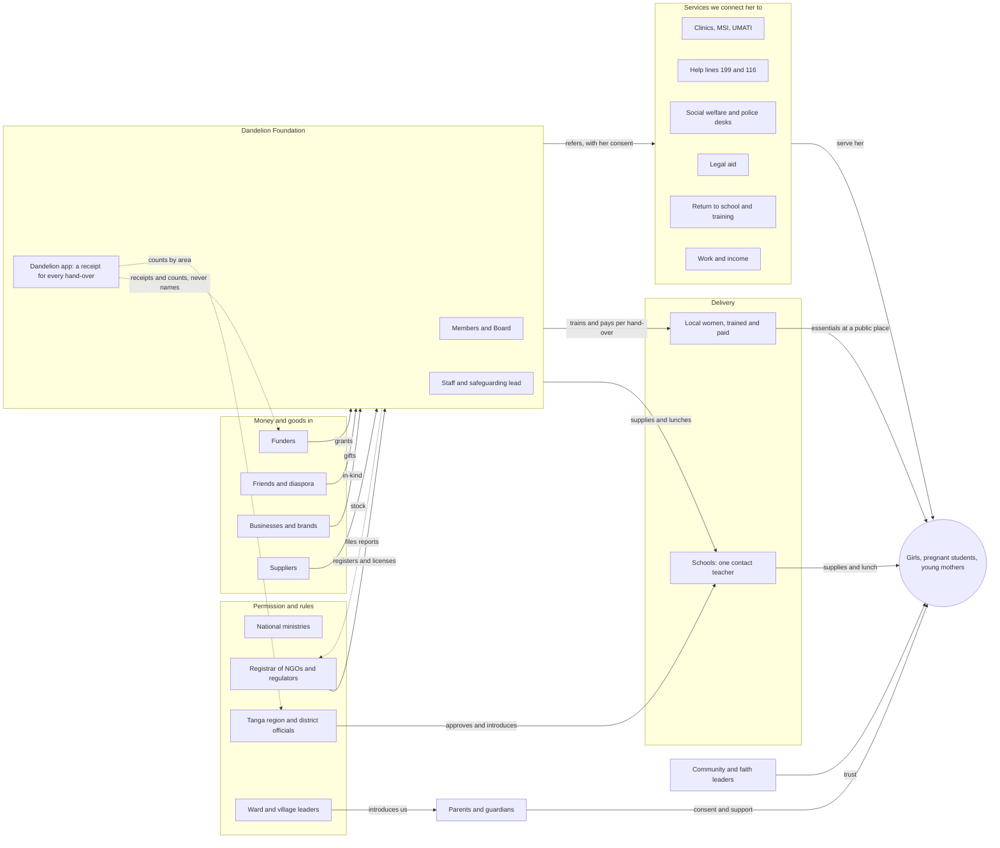

# Dandelion Foundation — Prompt O: every stakeholder, what they want, and what we ask (v1.0)

Founder direction (2026-10-02), in the founders' words:

- *Think about all of the stakeholders, their incentives, roles etc., and how we can partner with all of them and
  what to ask each (and in what capacity) to reach whatever our goal is. Show me a flow chart of all stakeholders
  organized.*
- *Identify the mission, incentives and goals of all partners, see where we can add value and align, and help get or
  give them what they want. Think about the right and wrong way to communicate this, and our context: a new
  organisation.*

Prompt J (2026-10-01) mapped the stakeholders of one sale in the app. This prompt works at the level of **Dandelion
Foundation** as set out in its constitution (ADR-046): who must say yes, who does the work, who pays, who checks us,
and in what order to approach them. Part 1 is the response, Part 2 is a reusable prompt for keeping the partner
spreadsheet up to date, and Part 3 lists the founders' decisions.

Placeholders in **[brackets]** are for the founders to fill in. Organisation names are examples to check, not
partners: nobody becomes a partner before a Board-approved agreement (Article 35).

---

## Part 1 — Response

### 1.1 The goal everything points at (draft for the founders to confirm)

> By **[December 2027]**, **[250]** female students, pregnant students and young mothers in **[Town]** and
> **[Village]**, Tanga Region, stay in school or return to it. Each has hygiene essentials every month, school
> supplies and lunch, confidential support when she needs it, and a path to skills and income. The work is run
> safely, every hand-over is proven, and no single funder pays for all of it.

How we will know (one line each in the monthly report, counts only):

- girls enrolled and attending, each term;
- student mothers who returned to school, and stayed;
- essentials handed over on time, with a receipt for each;
- referrals made, and referrals completed;
- local women earning from the work, and what they earned;
- cost per girl per month;
- number of funders (target: at least three, none paying more than half).

### 1.2 The map

Everything flows towards the girl, and proof flows back out. Permission comes first, from the top. Money and goods
come in from the left, through the Foundation, which tracks every hand-over. Delivery reaches her through local women
and schools. Services reach her by referral, always with her consent. Proof goes back to funders and government as
receipts and counts, never names.

The same map, with a filterable card for every stakeholder, is a private page for the founders:
https://claude.ai/artifact/EZPF9iif8y34s47V9wmLbQ (the founders can share it from its Share menu).

### 1.3 In what capacity: the words we use

Every stakeholder gets one or two of these. The capacity decides the ask: an approver gets a request for permission,
a funder gets a proposal, a referral partner gets a procedure.

| Capacity | What it means | Example ask |
| --- | --- | --- |
| Co-designer | Tells us what is needed and whether it works | Join a listening session |
| Approver | Must say yes before we act | A letter of introduction |
| Door-opener | Introduces us to the people who matter | Introduce us at a village meeting |
| Implementer | Does part of the work with us | One contact teacher |
| Referral partner | We send girls to them, they send girls to us | A named contact and a referral path |
| Supplier | Sells to us | An NGO price |
| Funder | Pays for the work | A small grant tied to milestones |
| In-kind donor | Gives products or services | 50 kits for a 3-month trial |
| Adviser | Shares know-how | One 30-minute call |
| Champion | Speaks up for the work | Talk to other parents |
| Learning partner | Studies what works | Advice on measuring results |
| Watchdog | Holds us to account | Audit, registration, data protection |

### 1.4 The order matters

A new organisation earns each yes with the one before it. Funders ask whether the district approves; the district
asks whether the Foundation is registered and has a safeguarding policy; parents ask whether the school trusts us.
So we go in this order, and we never skip a step to reach money faster.

| Phase | When | Who | Done when |
| --- | --- | --- | --- |
| **0 Get legitimate** | Now until registration | Board, members, Registrar, bank, auditor, safeguarding lead, PDPC | Registered; bank account open; Safeguarding Policy adopted |
| **1 Permission and listening** | Months 1–2 | Region and district officials, ward and village leaders, head teachers, parents, girls, peer NGOs | Letter of introduction; two schools agreed; girls and parents heard |
| **2 Services and supply** | Months 2–3 | Clinics, MSI and UMATI, help lines, social welfare, police desks, legal aid, return-to-school, suppliers, mobile money, local women | Referral paths agreed; prices agreed; first women trained and checked |
| **3 First money, start small** | Months 3–6 | Small funders, friends and diaspora, local businesses, brands (in-kind), training and employers | 50 girls served for a month, then 250 |
| **4 Prove, learn, grow** | Months 6–12 and after | Larger funders and UN, ministries, researchers, last-mile networks, media | Six monthly reports; a second funder; a decision to grow or fix |

### 1.5 Every stakeholder: capacity, what they want, what we offer, what we ask

"First ask" is small and specific, so it is easy to say yes. "Later ask" comes only after the first one went well.

#### The girls we serve

| Stakeholder | In what capacity | What they want | What we offer | First ask | Later ask | Phase | Watch out |
| --- | --- | --- | --- | --- | --- | --- | --- |
| **Girls in school** (Female students in [Town] and [Village] schools) | Co-designers | To stay in school, privacy, no shame, products that work, someone to trust | Essentials close to home, confidential help, a voice in what we do | Join a listening session, with the school's and parents' agreement | Help shape the programme; peer roles once 18 or over | 1 | Most are under 18: consent through school and parents; never trade their stories, photos or data |
| **Pregnant students and student mothers** (Girls who became pregnant while in school) | Co-designers | To stay in or return to school without stigma; a healthy baby; privacy | Baby-care essentials, confidential support, help returning to school | A private conversation through a trusted teacher or health worker, only if she wants it | Mentor others once she is 18 or over | 1 | Highest stigma and safeguarding risk; follow the Safeguarding Policy and the law strictly |
| **Young mothers out of school** (Young single mothers facing hardship) | Co-designers and future earners | Income, baby essentials, skills, respect | Baby-care, training, and paid work in our own programmes | Tell us which skills and work they want | Train and work as local women in our programmes | 2 | Pay fairly and on time; no unpaid 'volunteering' expected |

#### Her circle

| Stakeholder | In what capacity | What they want | What we offer | First ask | Later ask | Phase | Watch out |
| --- | --- | --- | --- | --- | --- | --- | --- |
| **Parents and guardians** (Mothers, fathers, grandparents, guardians) | Approvers (for under-18s) and champions | A safe, respected, educated daughter; low cost; the family's good name | Free or fair-price essentials, school support, respect and privacy | Come to one school meeting and agree to their daughter taking part | Speak for the programme to other parents | 1 | Some may oppose help for pregnant girls; what is shared with them follows the Safeguarding Policy |
| **Community and faith leaders** (Elders, imams, pastors, women's group leaders) | Door-openers and champions | Community welfare, a respected role, no outsiders imposing values | Local jobs for women, visible benefit, being consulted first | A courtesy visit and their support to introduce the programme | Help reduce stigma for pregnant students and young mothers | 1 | We are non-religious and non-partisan: work with all faiths, favour none |
| **Ward and village leaders** (Ward and village executive officers, village and street chairs) | Local approvers and door-openers | Development in their area, being informed, credit for progress | Courtesy, regular updates, local jobs | Introduce us at a village meeting and agree the public meeting points | Help choose local women to recruit | 1 | Never start in a village before they know us |
| **Schools** (Head teachers, guidance teachers, school boards) | Implementers and referral partners | Attendance, results, fewer drop-outs, help for returning mothers, no extra workload | Supplies, lunches, discreet hygiene essentials, re-entry support, counts for their students | One contact teacher and a list of students needing support, with families' agreement | A private room; joint sessions with health partners | 1 | Needs the District Education Officer's permission first |

#### Permission and rules

| Stakeholder | In what capacity | What they want | What we offer | First ask | Later ask | Phase | Watch out |
| --- | --- | --- | --- | --- | --- | --- | --- |
| **Registrar of NGOs** (Ministry of Community Development, Gender, Women and Special Groups) | Approver and watchdog | Lawful, transparent NGOs that file reports and disclose funding | Complete, on-time filings and clear governance | The registration certificate | Approval of funding agreements, as the regulations require | 0 | Nothing goes public as 'registered' before the certificate |
| **Tanga region and district officials** (Regional Administrative Secretary, District Executive Director, District Education, Social Welfare, Community Development and Medical Officers) | Approvers and door-openers | Girls kept in school, the re-entry policy working, fewer teen pregnancies, NGOs that coordinate and report | Work within national guidelines, counts by area (never individuals), a place in district plans | A courtesy visit and a letter of introduction to [2] schools and the health facility | Join district coordination meetings; present results | 1 | Never surprise them: report to them before any media |
| **National ministries** (Education, Health, Community Development and Gender, PO-RALG) | Policy setters; champions later | National targets: school completion, re-entry, adolescent health, ending violence against children | Field evidence from a well-run pilot | No ask at first: follow their guidelines and keep them informed through the district | Present pilot results; join technical working groups | 4 | Go through the district, not around it |
| **Regulators** (PDPC (personal data), TMDA (pregnancy tests), TBS (product standards), TCRA (SMS sender ID)) | Approvers and watchdogs | Compliance | Compliance built into how we work | Register with the PDPC; confirm pregnancy-test rules with TMDA; register an SMS sender ID | Regular compliance reports | 0 | Health data is the most sensitive data we hold |
| **Police Gender and Children's Desks** (The desk at the nearest police station) | Referral partner for safeguarding | Cases reported properly; children kept safe | Correct, timely reporting under the law; trained staff | A named contact for safeguarding referrals in our area | Joint awareness sessions | 2 | Explain the limits of confidentiality to every girl before she shares |

#### Services we connect her to

| Stakeholder | In what capacity | What they want | What we offer | First ask | Later ask | Phase | Watch out |
| --- | --- | --- | --- | --- | --- | --- | --- |
| **Health facilities** (Dispensaries, health centres, the District Medical Officer) | Referral partners; testing under qualified supervision | More young people using services, fewer complications, good records | Referrals, follow-up and essentials for the girls they see | Agree a referral path, and who does pregnancy testing and counselling | Youth-friendly hours or sessions at schools | 2 | Health services only by qualified people or licensed facilities |
| **Reproductive health providers** (MSI Tanzania, UMATI) | Referral partners and session providers | Reach young people with youth-friendly, confidential services | Referrals, and counts (never names) that show their reach | One session for our 250 students, with school and parents' agreement, and a referral contact in Tanga | Train our local women and staff | 2 | Age-appropriate content agreed with the school first |
| **Help lines** (199 Afya Call Centre, 116 Child Helpline (C-Sema)) | Referral partners | People who need them to know the number | The numbers on a card for every girl | Confirm the exact wording to print, and how they refer back | Share call trends for our area, counts only | 2 | Check numbers before printing |
| **Social welfare officers** (District social welfare office) | Referral partners; lead on child protection cases | Vulnerable children identified and supported | Referrals and help with follow-up | A named contact and a joint procedure for cases | Joint case reviews | 2 | They lead child protection cases, not us |
| **Legal aid** (LHRC, TAWLA, WLAC, local paralegals) | Referral partners | Reach women and girls who need legal help (violence, child maintenance) | Referrals | A referral contact in Tanga and a short rights session | Regular legal clinics near our schools | 2 | Only with the girl's consent, unless the law requires otherwise |
| **Return to school and alternative education** (Institute of Adult Education (SEQUIP alternative pathway), Folk Development Colleges) | Referral partners | Girls who left school enrolling and finishing | Referrals, plus essentials and childcare links so they can attend | How a young mother in Tanga enrols, and a contact | A joint plan for every young mother we serve | 2 | Check current enrolment rules locally |
| **Training and employers** (VETA, digital skills programmes, local employers, women's savings groups) | Trainers and employers | Trainees who finish; reliable workers; community standing | Motivated young women, supported while they train | [5] training places or internships | Hiring; mentoring | 3 | Fair pay; no unpaid 'internships' for young mothers who need income |

#### Delivery and supply

| Stakeholder | In what capacity | What they want | What we offer | First ask | Later ask | Phase | Watch out |
| --- | --- | --- | --- | --- | --- | --- | --- |
| **Local women** (Women aged 18 or over in [Town] and [Village]) | Implementers, paid | Income, respect, safety, being paid on time | Training, fair pay for every hand-over, mobile-money payment | Apply and join the first training | Lead and train other women | 2 | Background checks and the code of conduct before any contact with girls |
| **Staff, volunteers and safeguarding lead** (Executive Director (to appoint), safeguarding lead, volunteers) | Implementers | Meaningful work, clear roles, fair pay or recognition | Training and clear policies | Appoint an Executive Director and a safeguarding lead | Grow the team as funding allows | 0 | Checks before any contact with children |
| **Pad, diaper and hygiene makers** (Kasole Secrets, AFRIpads, Days for Girls, Softcare, diaper makers) | Suppliers and in-kind donors | Sales, new markets, brand trust, impact stories | Steady orders paid on agreed terms, demand by area, feedback | An NGO price for 250 reusable kits or 3,000 packs delivered to Tanga | Donate the first 50 kits for a 3-month trial | 2 | TBS mark; no marketing to girls without consent |
| **School supplies and food suppliers** (Wholesalers, local farmers, food vendors) | Suppliers | Steady orders, fair prices, prompt payment | Steady local orders | Prices for [250] school packs and a daily lunch per student | Term contracts | 2 | Food safety; buy local where possible |
| **Mobile money and SMS** (M-Pesa, Airtel Money, Mixx by Yas, HaloPesa; an SMS gateway) | Infrastructure suppliers; possible sponsors | Transactions, new users, community standing | Users and transactions | An NGO account, the tariffs, and an SMS sender ID | Fee-free payments for girls, as their community support | 2 | Texts never name the product |

#### Money and knowledge

| Stakeholder | In what capacity | What they want | What we offer | First ask | Later ask | Phase | Watch out |
| --- | --- | --- | --- | --- | --- | --- | --- |
| **Small first funders** (Segal Family Foundation, Women Fund Tanzania Trust) | Funders | Local leadership, early bets that can grow, clear results | A Board with a Tanzanian majority, proof of every hand-over, the cost per girl | An introduction call; then a small grant tied to milestones | Renewal and introductions to other funders | 3 | Don't ask for money in the first message |
| **Friends, diaspora and individual donors** (Supporters in Tanzania and abroad, including the US) | Funders and champions | To see exactly where their money goes; a personal connection | Receipts, updates, stories that never identify a girl | Join the mailing list; give once registration and the bank account are ready | Monthly giving; introductions | 3 | No US tax receipts until a US partner organisation exists |
| **Local businesses and banks** (CRDB Bank Foundation, NMB Foundation, Tanga businesses) | Funders, in-kind donors, employers | Community reputation, social-responsibility goals, future customers | Local recognition (with their consent) and reports | Sponsor lunches for one term at one school | Internships; yearly sponsorship | 3 | Recognition never uses girls' images |
| **Global brands** (Procter & Gamble (Always), Kimberly-Clark (Kotex)) | In-kind donors | Brand trust, market share, social-responsibility goals | Distribution with proof, and feedback from users | The contact for their product donation programme in Tanzania | A yearly donation tied to our reports | 3 | Avoid giveaways that undercut local sellers |
| **Large funders and the UN** (UNICEF, UNFPA, UN Women, Mastercard Foundation, Gates Foundation, CIFF, bilateral donors) | Funders later; advisers now | Reach the hardest-to-reach, evidence, accountable local partners aligned with national plans | Last-mile reach with proof; field evidence | Advice and a technical contact | A grant after 6–12 months of results | 4 | Don't promise scale we can't deliver |
| **Peer NGOs** (Camfed, BRAC Tanzania, Femme International, Msichana Initiative, Plan International) | Partners and advisers | More girls reached, no duplication, lasting results, credit for their work | Local delivery, referrals, shared learning | Who works where in Tanga, and materials that already work | Joint programmes | 1 | Coordinate, don't compete; always credit their work |
| **Last-mile networks** (Kasha, Healthy Entrepreneurs, Living Goods, Solar Sister) | Partners | More income for their agents; new products and customers | Products and customers their agents can serve | Test together in one area | Shared training and supply | 4 | Same safeguarding rules for their agents as for ours |
| **Researchers** (NIMR, University of Dar es Salaam, NM-AIST) | Learning partners | Good data, publications, impact | A well-run pilot to study (counts only, with ethics approval) | Advice on measuring results | A joint study | 4 | Ethics approval before any study involving girls |
| **Media and advocates** (Local radio, newspapers, girls' rights advocates) | Champions | Real stories | Stories from adults who consent | Nothing until there are results; then share them | Campaigns with government and peers | 4 | Never identify a girl; tell government first |

#### Inside the Foundation

| Stakeholder | In what capacity | What they want | What we offer | First ask | Later ask | Phase | Watch out |
| --- | --- | --- | --- | --- | --- | --- | --- |
| **Members and General Meeting** (Founder, ordinary and honorary members) | Owners: decide | The mission delivered, accountability | Information and a vote | Recruit [10] members who bring skills and networks | Active committees | 0 | Fees and admission as the constitution sets |
| **Board of Directors** (Chairperson, Secretary, Treasurer, appointed directors) | Owners: govern | Legal compliance, reputation, results | Clear reports and decisions to make | Adopt the Safeguarding Policy; appoint the Executive Director; approve each partnership agreement | A strategic plan for the General Meeting | 0 | Partners and funders never control the Foundation |
| **Independent auditor** (A qualified auditor appointed by the General Meeting) | Watchdog | Clean books | Proper books and records from day one | Appointment at the first annual meeting | Yearly audit | 0 | Every payment approved by two officers |
| **US partner organisation (future)** (A possible US charity to support the Foundation) | Channel for US gifts | Tax-exempt status, clear grant agreements | A Board-approved agreement | Decide whether to create one; get legal advice | Grants to the Foundation under agreement | 3 | No transfer of control (Article 35) |

### 1.6 Where what they want pulls against what the girl needs

| Tension | How we handle it |
| --- | --- |
| Brands and donors want to give products away; free piles undercut the local women who earn from steady supply | Donated products go through the same local women and receipts; no mass giveaways |
| Government and funders want data; girls need privacy | Counts by area only; never a name, a school list of pregnant girls, or a photo |
| Parents want to know; a girl may need confidentiality | The Safeguarding Policy sets what is shared and when; we explain its limits to her first |
| Funders want scale and stories quickly; safe work starts small | Promise only what the next phase can deliver; stories only from consenting adults |
| Schools want help without extra work | One contact teacher, little paperwork, and we do the follow-up |
| Health and service providers want referrals they can count | They get counts, never personal details; referrals only with her consent |
| Local women want more income; girls need safe, reliable service | Pay per hand-over, background checks, code of conduct, a second woman ready if one is late |
| Media want faces | No girl is ever identified; government hears results before media do |

### 1.7 Who on our side leads each relationship (proposal)

Each relationship needs one named owner, so nothing is promised twice or forgotten.

| Relationships | Proposed lead | Why |
| --- | --- | --- |
| Government, ward and village leaders, community and faith leaders | Chairperson, with the Tanzanian directors | Local standing and language |
| Girls, schools and young mothers | Secretary (Youth and Student Representative) | The girls' voice in the Foundation |
| Funders abroad, banks, the auditor, financial reports | Treasurer | Finance role under the constitution |
| Health, social welfare, legal aid, help lines | The safeguarding lead, once appointed | Referrals are safeguarding work |
| Suppliers, mobile money, local women | The Executive Director, once appointed | Day-to-day operations |

### 1.8 How we ask

The full guide is in `docs/WEBSITE_COPY.md` ("How we talk about partnerships"). In short:

1. Read their published plan first; open with their goal, in their words.
2. Offer something that moves their measure, then ask for one small thing, with a number, a place and a date.
3. Say plainly that we are new, being registered, and starting small in Tanga.
4. Show how they will know it worked.
5. Name our limits: no girls' personal data, no advertising to girls, partners never control the Foundation.

---

## Part 2 — The prompt (reusable)

Give this to Claude, or any assistant, with the partner spreadsheet attached, whenever new organisations are added
or a month has passed.

> You are helping Dandelion Foundation, a new non-profit being registered in Tanzania, to plan its partnerships. Its
> goal: [paste §1.1]. Its constitution allows: [paste Articles 8–10]. It is new, starting in [Town] and [Village],
> Tanga Region, and must not overstate its size, its registration or its partners.
>
> For every organisation in the attached sheet:
>
> 1. **Who they are:** type (one of: the girls, her circle, permission and rules, services, delivery and supply, money
>    and knowledge, inside the Foundation) and the phase (0–4) in which we approach them.
> 2. **Their mission and goals for 2026–2030**, from their own published sources, with the link. If you can't find a
>    source, write "Confirm" and don't guess.
> 3. **What they want and what pressures them:** targets, reports, budgets, reputation, rules.
> 4. **In what capacity** they could work with us (use the capacities in §1.3), and **what we can offer** that moves
>    their own measure.
> 5. **One small first ask** with a number, a place and a date, and **one later ask** for after it goes well.
> 6. **Where their incentives could hurt a girl,** and the rule that prevents it (§1.6).
> 7. **Who on our side leads** (§1.7), and **how to reach them** (a named role, never a guessed email).
> 8. A **first message** of five or six sentences that opens with their goal, offers before asking, says we are new,
>    makes the one small ask, and is signed by the lead. Follow "How we talk about partnerships".
>
> Output one line per organisation, tab-separated, ready to paste into the sheet, with no tabs or line breaks inside
> a cell. Never call anyone a partner, never invent a quote, a contact or a number, and never include anything about
> an individual girl.

---

## Part 3 — Decisions for the founders

1. **Confirm the goal (§1.1):** the date, the number of girls, the town and the village.
2. **Confirm the order (§1.4):** in particular, no fundraising asks before registration and the bank account.
3. **Name the relationship leads (§1.7)**, including who leads until an Executive Director and a safeguarding lead
   are appointed.
4. **Choose the first ten** to approach in Phase 1: suggested Tanga region and district officials, the two schools,
   ward and village leaders, one peer NGO already in Tanga, and MSI or UMATI for Phase 2.
5. **Agree the red lines in §1.6** as Board policy, so every partner hears the same answer.
